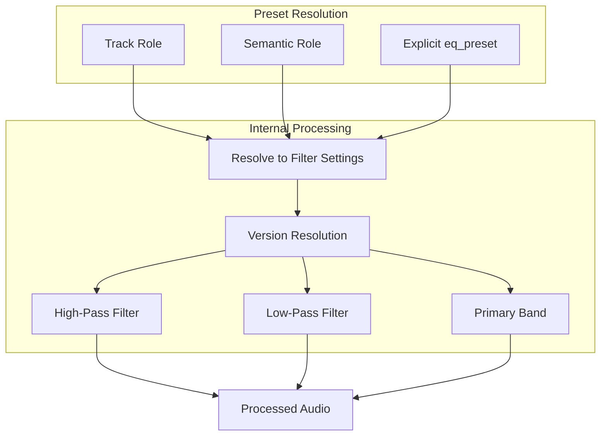

# EQ System v1 Implementation Plan (Refined)

## Design Philosophy

### Intent-First, Not Frequency-First

The EQ system follows the engine's existing pattern: **semantic intent drives behavior, implementation stays hidden**.

| Approach | Example | For Whom |

|----------|---------|----------|

| Intent-first (exposed) | `"eq_preset": "dialogue_clean"` | Timeline authors |

| Frequency-first (internal) | `high_pass: 80Hz, presence: +2dB@3kHz` | Engine internals |

Timeline authors describe **what they want**, not how to achieve it. The engine translates intent to frequencies internally.

---

## What is EQ (Equalization)?

EQ adjusts the volume of specific frequency ranges within audio — precision volume control that lets you:

- **Filter out** unwanted frequencies (rumble, harshness)
- **Boost** frequencies that add clarity or presence
- **Cut** frequencies that cause muddiness or masking

### Why EQ Matters for Your Engine

Your insight captures it perfectly:

> *"EQ gives the engine control over space, not just volume. Sounds stop competing and start coexisting by design."*

**Without EQ**: Voice, music, and ambience all fight for the same 200-2000 Hz range — even with ducking, the mix feels clouded.

**With EQ**: Each role occupies its own frequency "lane" — ducking can be lighter and more natural because elements aren't clashing in the first place.

---

## v1 Scope (Simplified)

### What v1 Includes

| Feature | Description |

|---------|-------------|

| High-pass filter | Remove low rumble below cutoff |

| Low-pass filter | Remove harsh highs above cutoff |

| Single primary band | One boost/cut at a key frequency per role |

| Intent presets | Semantic names mapping to filter settings |

| Role-based defaults | Automatic EQ based on track role |

### Primary Band Constraints (Prevent Surgical Drift)

To keep presets broad and musical (not surgical), the primary band has hard limits:

| Parameter | Constraint | Rationale |

|-----------|------------|-----------|

| Q (bandwidth) | 0.7 – 1.2 | Wide enough to be musical, not narrow notches |

| Gain | ±3 dB max | Gentle shaping, not aggressive boosts/cuts |

| Frequency | 80 Hz – 8 kHz | Audible range where broad shaping matters |

These constraints are enforced in code and documented for future preset authors.

### What v1 Defers

| Feature | Reason to Defer |

|---------|-----------------|

| Full parametric chains | Complexity; wait for stable v1 behavior |

| Narrow Q bands at scene level | Risk of tonal artifacts and preset conflicts |

| Dynamic/adaptive EQ | Requires more sophisticated analysis |

---

## Intent Presets

### Versionable Presets (Future-Proof)

Internally, presets support versioning for safe evolution:

```python
# Internal representation
"dialogue_clean@v1"  # Explicit version
"dialogue_clean"     # Resolves to latest (currently v1)
```

**Benefits:**

- Improve EQ curves over time without breaking old renders
- A/B test preset variations
- Timeline authors just use `"dialogue_clean"` — versioning is internal

### Exposed Presets (Timeline-Friendly)

Authors use semantic names; the engine handles frequency details internally:

```json
"eq_preset": "dialogue_clean"
```

| Preset | Intent | Internal Mapping |

|--------|--------|------------------|

| `dialogue_clean` | Clear voice, no rumble | HPF 80Hz, +2dB @ 3kHz |

| `dialogue_warm` | Rich voice, less bright | HPF 60Hz, +1dB @ 200Hz |

| `dialogue_broadcast` | Broadcast-ready voice | HPF 100Hz, +3dB @ 3kHz, -1dB @ 200Hz |

| `music_full` | Full spectrum music | HPF 40Hz |

| `music_bed` | Music as background bed | HPF 80Hz, LPF 12kHz, -2dB @ 2.5kHz |

| `background_soft` | Non-invasive ambience | HPF 100Hz, LPF 8kHz |

| `background_distant` | Far-away feel | HPF 150Hz, LPF 6kHz, -2dB @ 1kHz |

| `sfx_punch` | Impactful SFX | HPF 60Hz, +2dB @ 100Hz |

| `sfx_subtle` | Gentle SFX presence | HPF 80Hz, LPF 10kHz |

### Role-Based Defaults

When no preset is specified, roles get sensible defaults automatically:

| Role | Default Preset | Rationale |

|------|----------------|-----------|

| voice | `dialogue_clean` | Clarity is paramount |

| music | `music_bed` | Creates space for dialogue |

| background | `background_soft` | Non-invasive by design |

| sfx | (none) | Varies too much; use semantic_role |

SFX semantic roles also map to presets:

| Semantic Role | Default Preset |

|---------------|----------------|

| impact | `sfx_punch` |

| movement | `sfx_subtle` |

| ambience | `background_soft` |

| interaction | (none) |

| texture | `background_distant` |

---

## Scene-Level EQ (Restricted)

### Allowed at Scene Level

Only **broad tonal shaping** — safe operations that won't conflict with role presets:

| Operation | Example | Use Case |

|-----------|---------|----------|

| Tonal tilt | `"tilt": "warm"` or `"tilt": "bright"` | Shift overall scene tone |

| High shelf | `"high_shelf": -2` | Gentle high-frequency reduction |

| Low shelf | `"low_shelf": +1` | Subtle low-end warmth |

### NOT Allowed at Scene Level

- Narrow parametric bands (specific Hz + Q)
- High-pass/low-pass overrides (role presets handle this)
- Per-role EQ overrides (keep it simple)

### Scene EQ Schema

```json
"rules": {
  "eq": {
    "tilt": "warm",      // "warm", "neutral", "bright"
    "high_shelf": -2,    // dB adjustment above ~4kHz
    "low_shelf": 1       // dB adjustment below ~200Hz
  }
}
```

---

## Implementation Architecture

### Processing Position

EQ applies **early in the chain**, shaping frequencies before other processing:

```
1. Load audio
2. Apply track/clip gain
3. **Apply EQ (role preset)** ← NEW
4. Apply SFX processing
5. Apply energy ramp
6. Apply ducking (lighter now due to EQ separation)
7. Apply compression
8. Overlay to canvas
9. Apply scene-level tonal shaping ← NEW (subtle)
10. Apply fades
```

### Data Flow



---

## Implementation Details

### 1. New DSP Module: [dsp/eq.py](dsp/eq.py)

```python
# Core filter functions (internal)
def apply_high_pass(audio: AudioSegment, cutoff_hz: float) -> AudioSegment
def apply_low_pass(audio: AudioSegment, cutoff_hz: float) -> AudioSegment
def apply_primary_band(audio: AudioSegment, freq_hz: float, gain_db: float, q: float = 1.0) -> AudioSegment
    # Note: "primary_band" not "presence_band" — it's not always presence (e.g., low-mid warmth cuts)
    # Constraints enforced: Q in 0.7-1.2, gain in ±3dB, freq in 80-8000Hz
def apply_shelf(audio: AudioSegment, freq_hz: float, gain_db: float, shelf_type: str) -> AudioSegment

# Intent-based API (exposed)
def apply_eq_preset(audio: AudioSegment, preset_name: str) -> AudioSegment
def get_preset_for_role(role: str, semantic_role: str = None) -> str
def apply_scene_tonal_shaping(audio: AudioSegment, scene_eq: dict) -> AudioSegment
def resolve_preset_version(preset_name: str) -> str  # "dialogue_clean" → "dialogue_clean@v1"
```

### 2. Preset Definitions: [dsp/eq_presets.py](dsp/eq_presets.py)

```python
# Versioned preset definitions
EQ_PRESETS = {
    "dialogue_clean@v1": {
        "high_pass": 80,
        "primary": {"freq": 3000, "gain": 2.0, "q": 1.0}
    },
    "music_bed@v1": {
        "high_pass": 80,
        "low_pass": 12000,
        "primary": {"freq": 2500, "gain": -2.0, "q": 0.8}
    },
    # ... etc
}

# Alias mapping (what timeline authors use → internal versioned name)
PRESET_ALIASES = {
    "dialogue_clean": "dialogue_clean@v1",
    "music_bed": "music_bed@v1",
    # Future: "dialogue_clean": "dialogue_clean@v2" (when ready)
}

ROLE_DEFAULT_PRESETS = {
    "voice": "dialogue_clean",
    "music": "music_bed",
    "background": "background_soft"
}

# Constraint constants (enforced in apply_primary_band)
PRIMARY_BAND_Q_MIN = 0.7
PRIMARY_BAND_Q_MAX = 1.2
PRIMARY_BAND_GAIN_MAX = 3.0  # ±3 dB
PRIMARY_BAND_FREQ_MIN = 80
PRIMARY_BAND_FREQ_MAX = 8000
```

### 3. Integration: [renderer/clip_processor.py](renderer/clip_processor.py)

Add EQ step after gain, before SFX processing:

```python
# Step 3: Apply EQ (role preset or explicit)
eq_preset = clip.get("eq_preset") or get_preset_for_role(track_role, semantic_role)
if eq_preset:
    audio = apply_eq_preset(audio, eq_preset)
```

### 4. Timeline JSON Schema

**Track-level preset:**

```json
{
  "id": "dialogue",
  "role": "voice",
  "eq_preset": "dialogue_broadcast"  // Override default
}
```

**Clip-level preset:**

```json
{
  "file": "audio/voice/narrator.wav",
  "eq_preset": "dialogue_warm"  // Override for this clip
}
```

**Scene-level tonal shaping:**

```json
"rules": {
  "eq": {
    "tilt": "warm"
  }
}
```

### 5. Dependencies

Add to [requirements.txt](requirements.txt):

```
scipy>=1.9.0
```

---

## EQ + Ducking Relationship

### Design Goal: Loosely Coupled

EQ improves spectral separation **so ducking can be lighter**:

| Scenario | Without EQ | With EQ |

|----------|------------|---------|

| Voice over music | Duck music -12dB | Duck music -6dB (EQ already carved space) |

| Ambience behind dialogue | Heavy ducking or muddy | Light ducking, clean separation |

### Implementation

- EQ and ducking remain **independent systems**
- No automatic adjustment of ducking based on EQ
- Authors can manually reduce duck_amount when using EQ presets
- Future: could suggest lighter ducking when EQ is active (v2)

---

## Files to Create/Modify

| File | Action |

|------|--------|

| [dsp/eq.py](dsp/eq.py) | Create - core filter functions |

| [dsp/eq_presets.py](dsp/eq_presets.py) | Create - preset definitions |

| [dsp/__init__.py](dsp/__init__.py) | Modify - export EQ functions |

| [renderer/clip_processor.py](renderer/clip_processor.py) | Modify - add EQ step |

| [renderer/track_mixer.py](renderer/track_mixer.py) | Modify - pass EQ config |

| [docs/timeline_json_schema.md](docs/timeline_json_schema.md) | Modify - document EQ |

| [requirements.txt](requirements.txt) | Modify - add scipy |

---

## Summary

This v1 EQ system:

- Exposes **intent-based presets** (`dialogue_clean`, `music_bed`) — timeline-friendly
- Keeps **frequency knowledge internal** — authors don't need to know Hz values
- Supports **versionable presets** — evolve curves without breaking old renders
- Restricts **scene-level EQ to broad shaping** — prevents conflicts and artifacts
- Focuses on **HPF + LPF + single primary band** — simple, stable foundation
- Enforces **primary band constraints** (Q: 0.7-1.2, gain: ±3dB) — prevents surgical drift
- Enables **lighter ducking** — spectral separation reduces amplitude compensation needs

The result: cleaner mixes with less aggressive ducking, achieved through semantic configuration that matches the engine's existing philosophy.